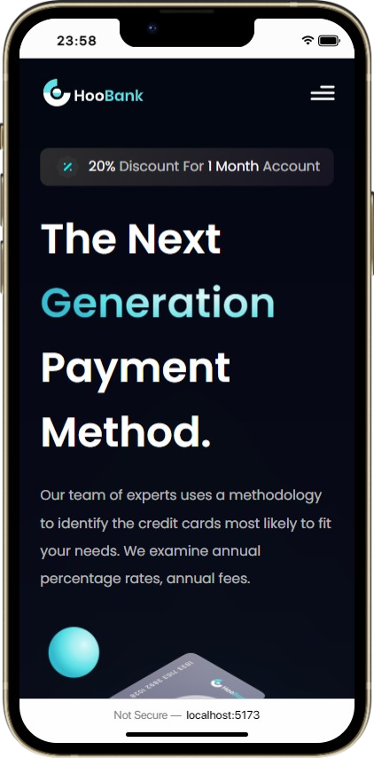
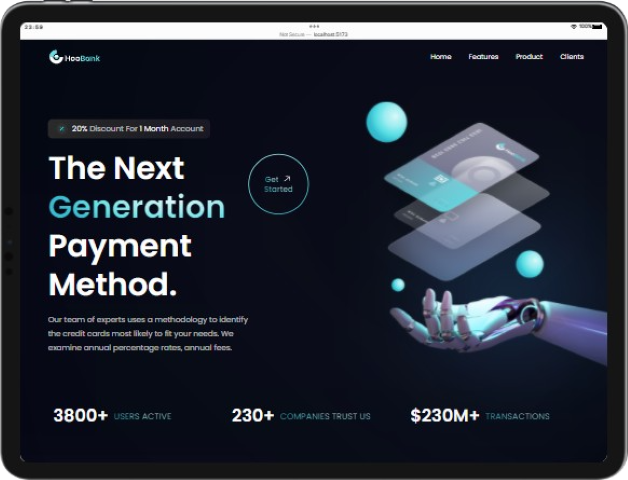

<h1 align="center">HooBank Landing Page 🏦</h1>

## What's this? 🤔

Hi there 👋! This is a landing page for HooBank, a fictitious app whose gorgeous design was created by [@adrianhajdin](https://github.com/adrianhajdin) and completed by their community over at [Figma](https://www.figma.com/).

### Tools used 🧰

- [NodeJS](https://nodejs.org/)
- [Vite](https://vitejs.dev/)
- [React](https://reactjs.org/)
- [Tailwind](https://tailwindcss.com/)
- [PostCSS](https://postcss.org/)
- [Chrome](https://www.google.com/chrome/)
- [Visual Studio Code](https://code.visualstudio.com/)

### [Live Preview 🎨](https://rwxdan-hoobank-lp.netlify.app/)

### ⚠ Warning ⚠

The `backdrop-filter: blur()` effect makes the colors look really off on Firefox, I'll try to implement it in a way that doesn't make the website look like it was made up by a clown...

|  |  |  |
| ----------------------------------------- | ----------------------------------------- | ------------------------------------------ |

### [Figma design](https://www.figma.com/file/bUGIPys15E78w9bs1l4tgS/HooBank?node-id=310%3A485&t=x9rw6TaVJ0bWystQ-1)

---

Credits to [@adrianhajdin](https://github.com/adrianhajdin) and their community for the design and specs.
